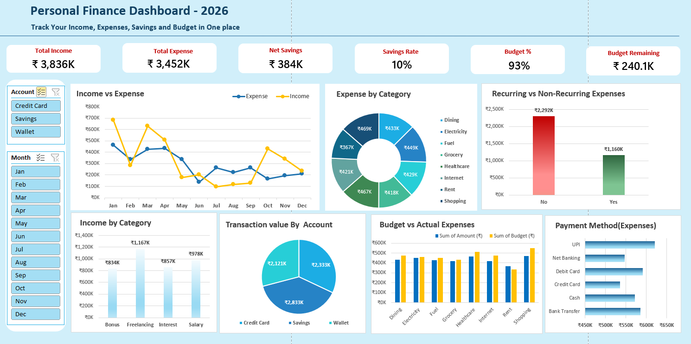

# Personal Finance Dashboard

An Excel dashboard that tracks personal income, expenses, and budget performance for the year 2026, built from a transaction-level dataset using PivotTables, GETPIVOTDATA-driven KPI cards, and interactive slicers.

## What it does

- Tracks Total Income, Total Expense, Net Savings, Savings Rate, Budget Utilization, and Remaining Balance
- Breaks down expenses by category, payment method, account, and recurring vs. non-recurring
- Breaks down income by category (Salary, Bonus, Freelancing, Interest)
- Compares budgeted vs. actual spend by category
- Shows month-by-month income vs. expense trend
- Lets you filter the whole dashboard using slicers (e.g. by transaction type)

## Workbook structure

| Sheet | Purpose |
|---|---|
| `Dataset` | 441 raw transactions — date, category, amount, budget, payment method, account, etc. |
| `KPI` | PivotTables and formulas that power every number and chart on the dashboard |
| `Dashboard` | The visual summary — KPI cards, charts, and slicers |

## How to use it

1. Open the `Dashboard` sheet — that's the main view.
2. Use the slicers to filter by transaction type or other fields.
3. All numbers update live off the `KPI` sheet, which pulls from `Dataset`. To refresh after editing the dataset, right-click any PivotTable → **Refresh**.

## Tools

Microsoft Excel — PivotTables, GETPIVOTDATA, SUMIFS, Excel Tables, Slicers, PivotCharts.

## Data note

The dataset is synthetically generated for demonstration purposes. Amounts, categories, and dates are realistic, but fields like `Merchant` and `Description` are randomized and don't always logically match the transaction category (e.g. a "Salary" entry may show an unrelated merchant name). This doesn't affect the totals or KPI logic — it's just a limitation of the mock data, not the dashboard itself.
